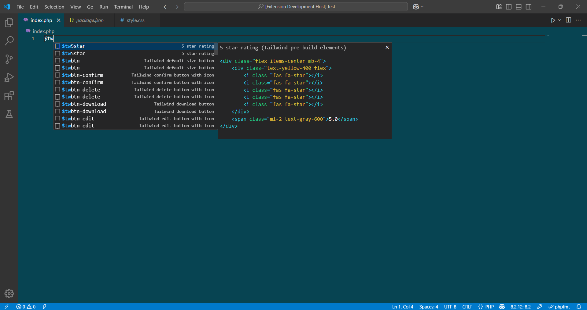
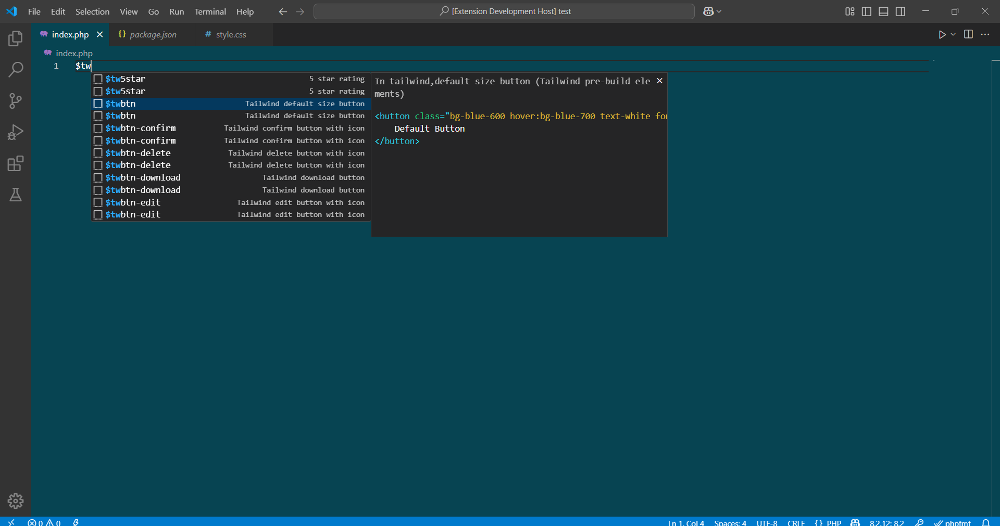
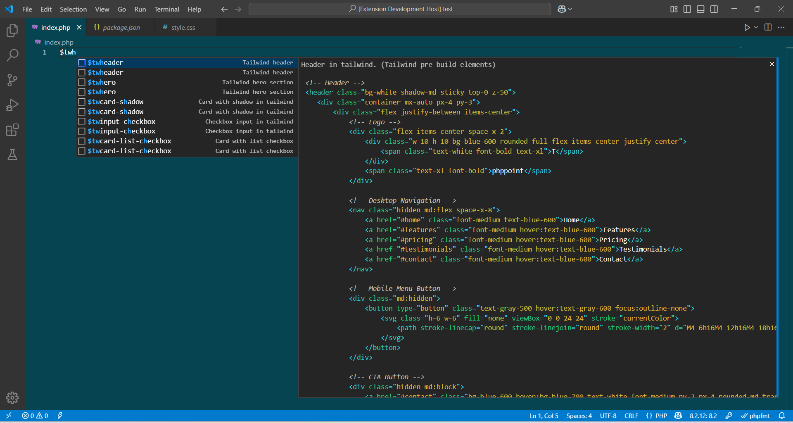
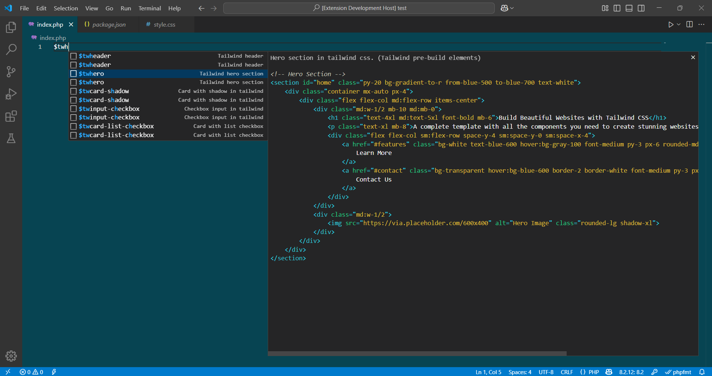

# Tailwind snippets - prebuild elements
* we are work on fast coding with tailwind css so this extension provide pre-build section,table,form,card,buttons,list  etc.

## Features
* Pre-build table,header,footer,form,buttons,list and more.

## How to use
* If you use this extension then type - for table `$twtable` , for form `$twform`, for header `$twheader`, for footer `$twfooter`
    and like that.

## Screenshots

## Release Notes

### v1.0.28032025
* fix bugs and added new components.

### v0.0.1
* Intial release

## For more information
* [PHP Point](https://phppoint.in)
* [Github - ](https://github.com/php-point/tailwind-snippets.git)